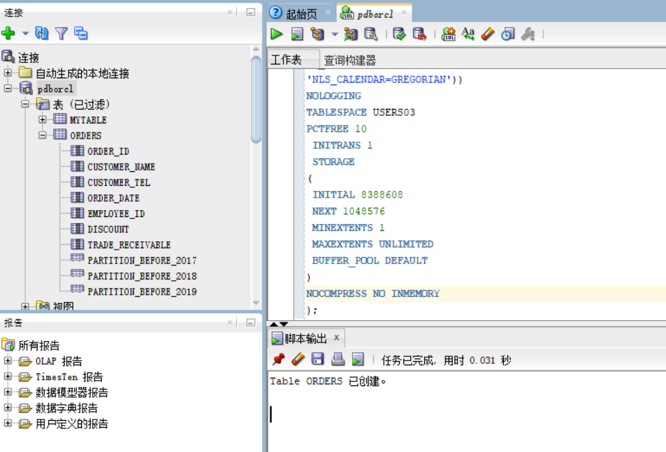
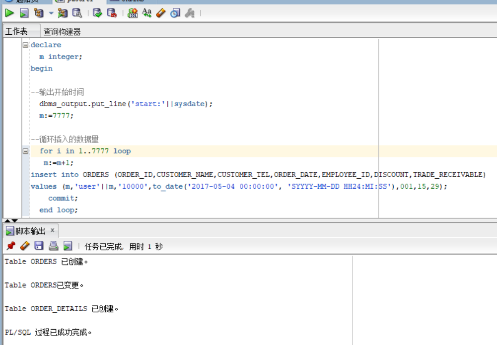
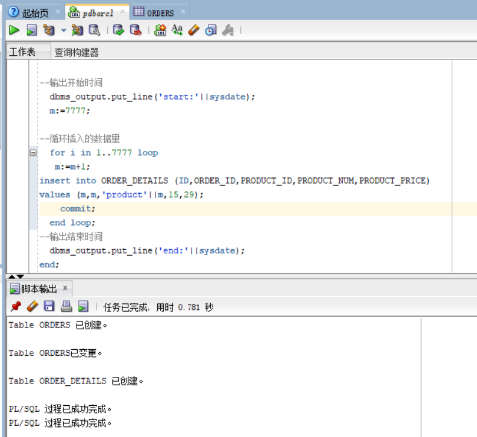

# 实验3：创建分区表 
## 实验目的：
掌握分区表的创建方法，掌握各种分区方式的使用场景。
## 实验内容：
- 本实验使用3个表空间：USERS，USERS02，USERS03在表空间中创建两张表：订单表（订单）与订单详表（ORDER_DETAILS）。
- 使用**你自己的账号**创建本实验的表，表创建在上述3个分区，自定义分区策略。
- 你需要使用系统用户给你自己的账号分配上述分区的使用权限你需要使用系统用户给你的用户分配可以查询执行计划的权限。
- 表创建成功后，插入数据，数据能并平均分布到各个分区每个表的数据都应该大于1万行，对表进行联合查询。
- 写出插入数据的语句和查询数据的语句，并分析语句的执行计划。
-进行分区与不分区的对比实验。
### 用户名：1123
## 实验步骤
在主表orders和从表order_details之间建立引用分区
在study用户中创建两个表：orders（订单表）和order_details（订单详表），两个表通过列order_id建立主外键关联。orders表按范围分区进行存储，order_details使用引用分区进行存储。

### 创建orders表的语句是：
```sql
CREATE TABLE orders 
(
 order_id NUMBER(10, 0) NOT NULL 
 , customer_name VARCHAR2(40 BYTE) NOT NULL 
 , customer_tel VARCHAR2(40 BYTE) NOT NULL 
 , order_date DATE NOT NULL 
 , employee_id NUMBER(6, 0) NOT NULL 
 , discount NUMBER(8, 2) DEFAULT 0 
 , trade_receivable NUMBER(8, 2) DEFAULT 0 
) 
TABLESPACE USERS 
PCTFREE 10 INITRANS 1 
STORAGE (   BUFFER_POOL DEFAULT ) 
NOCOMPRESS NOPARALLEL 
PARTITION BY RANGE (order_date) 
(
 PARTITION PARTITION_BEFORE_2017 VALUES LESS THAN (
 TO_DATE(' 2017-01-01 00:00:00', 'SYYYY-MM-DD HH24:MI:SS', 
 'NLS_CALENDAR=GREGORIAN')) 
 NOLOGGING 
 TABLESPACE USERS 
 PCTFREE 10 
 INITRANS 1 
 STORAGE 
( 
 INITIAL 8388608 
 NEXT 1048576 
 MINEXTENTS 1 
 MAXEXTENTS UNLIMITED 
 BUFFER_POOL DEFAULT 
) 
NOCOMPRESS NO INMEMORY  
, PARTITION PARTITION_BEFORE_2018 VALUES LESS THAN (
TO_DATE(' 2018-01-01 00:00:00', 'SYYYY-MM-DD HH24:MI:SS', 
'NLS_CALENDAR=GREGORIAN')) 
NOLOGGING 
TABLESPACE USERS02 
PCTFREE 10 
 INITRANS 1 
 STORAGE 
( 
 INITIAL 8388608 
 NEXT 1048576 
 MINEXTENTS 1 
 MAXEXTENTS UNLIMITED 
 BUFFER_POOL DEFAULT 
) 
NOCOMPRESS NO INMEMORY 
, PARTITION PARTITION_BEFORE_2019 VALUES LESS THAN (
TO_DATE(' 2019-01-01 00:00:00', 'SYYYY-MM-DD HH24:MI:SS', 
'NLS_CALENDAR=GREGORIAN')) 
NOLOGGING 
TABLESPACE USERS03 
PCTFREE 10 
 INITRANS 1 
 STORAGE 
( 
 INITIAL 8388608 
 NEXT 1048576 
 MINEXTENTS 1 
 MAXEXTENTS UNLIMITED 
 BUFFER_POOL DEFAULT 
) 
NOCOMPRESS NO INMEMORY 
);
```
### 创建order_details表的语句是：
```sql
CREATE TABLE order_details 
(
id NUMBER(10, 0) NOT NULL 
, order_id NUMBER(10, 0) NOT NULL
, product_id VARCHAR2(40 BYTE) NOT NULL 
, product_num NUMBER(8, 2) NOT NULL 
, product_price NUMBER(8, 2) NOT NULL 
, CONSTRAINT order_details_fk1 FOREIGN KEY  (order_id)
REFERENCES orders  (  order_id   )
ENABLE 
) 
TABLESPACE USERS 
PCTFREE 10 INITRANS 1 
STORAGE (   BUFFER_POOL DEFAULT ) 
NOCOMPRESS NOPARALLEL
PARTITION BY REFERENCE (order_details_fk1)
(
PARTITION PARTITION_BEFORE_2017 
NOLOGGING 
TABLESPACE USERS
PCTFREE 10 
 INITRANS 1 
 STORAGE 
( 
 INITIAL 8388608 
 NEXT 1048576 
 MINEXTENTS 1 
 MAXEXTENTS UNLIMITED 
 BUFFER_POOL DEFAULT 
) 
NOCOMPRESS NO INMEMORY
,PARTITION PARTITION_BEFORE_2018
NOLOGGING 
TABLESPACE USERS02
PCTFREE 10 
 INITRANS 1 
 STORAGE 
( 
 INITIAL 8388608 
 NEXT 1048576 
 MINEXTENTS 1 
 MAXEXTENTS UNLIMITED 
 BUFFER_POOL DEFAULT 
) 
NOCOMPRESS NO INMEMORY  
,PARTITION PARTITION_BEFORE_2019
NOLOGGING 
TABLESPACE USERS03
PCTFREE 10 
 INITRANS 1 
 STORAGE 
( 
 INITIAL 8388608 
 NEXT 1048576 
 MINEXTENTS 1 
 MAXEXTENTS UNLIMITED 
 BUFFER_POOL DEFAULT 
) 
NOCOMPRESS NO INMEMORY  
);
```
### 表创建成功



### 分配权限：


## 插入数据，数据能并平均分布到各个分区。每个表的数据都应该大于1万行，对表进行联合查询。
### 把数据插入orders表
```sql
declare 
  m integer; 

begin 
--输出开始时间 
  dbms_output.put_line('start:'||sysdate); 
  m:=7777;
--循环插入的数据量 
  for i in 1..7777 loop 
   m:=m+1; 
insert into ORDERS (ORDER_ID,CUSTOMER_NAME,CUSTOMER_TEL,ORDER_DATE,EMPLOYEE_ID,DISCOUNT,TRADE_RECEIVABLE) 
values (m,'user'||m,'10000',to_date('2016-05-04 00:00:00', 'SYYYY-MM-DD HH24:MI:SS'),001,15,29);
    commit; 
  end loop; 
--输出结束时间 
  dbms_output.put_line('end:'||sysdate); 
end;
```
对m的值进行修改,数据能平均分布到各个分区。总共的数据为13332条。
### 插入成功：

### 把数据插入order_details表
```sql
declare 
  m integer; 
begin 

--输出开始时间 
  dbms_output.put_line('start:'||sysdate); 
  m:=7777;

--循环插入的数据量 
  for i in 1..7777 loop 
   m:=m+1; 
insert into ORDER_DETAILS (ID,ORDER_ID,PRODUCT_ID,PRODUCT_NUM,PRODUCT_PRICE) 
values (m,m,'product'||m,15,29);
    commit; 
  end loop; 
--输出结束时间 
  dbms_output.put_line('end:'||sysdate); 
end;
```
对m的值进行改变，关联order表中的外键，数据能平均分布到各个分区。共插入13332条数据。
### 插入成功：

## 联合查询
```sql
select 
    orders.order_id as AID,
    orders.customer_name as customer_name,
    order_details.order_id as BID,
    ORDER_DETAILS.PRODUCT_ID as product_id
from
    ORDERS
INNER JOIN ORDER_DETAILS ON (orders.order_id=order_details.order_id);
```
### 联合查询结果：
![]


### 执行计划
![]
### 执行计划结论
最先执行的是TABLE ACCESS FULL，意思为对order_details表进行全表扫描。

然后其次执行的是PARTITION REFERENCE ALL，对分区进行引用。

然后对order_id进行索引唯一扫描，因为为order_details的外键。

又因为使用了join，所以又进行了NESTED LOOPS连接查询。

再对orders表进行TABLE ACCESS BY GLOBAL INDEX ROWID，即rowid与索引的扫描，找出符合条件的元素。最后将数据查出。
## 分区与不分区的对比
范围分区：就是根据数据库表中某一字段的值的范围来划分分区。

范围分区将数据基于范围映射到每一个分区，这个范围是你在创建分区时指定的分区键决定的。这种分区方式是最为常用的，并且分区键经常采用日期。

Oracle的表分区功能通过改善可管理性、性能和可用性，从而为各式应用程序带来了极大的好处。没有分配权限普通用户只能创建表，读写会报错，所有创建表用要分配权限。

