# 实验4：对象管理

## 实验目的：
了解Oracle表和视图的概念，学习使用SQL语句Create Table创建表，学习Select语句插入，修改，删除以及查询数据，学习使用SQL语句创建视图，学习部分存储过程和触发器的使用。

## 用户名：ayou

#### 建表成功
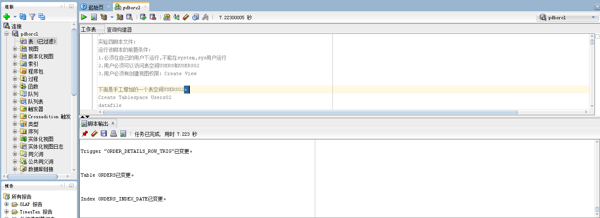

#### 从orders表中查询任一个order_id

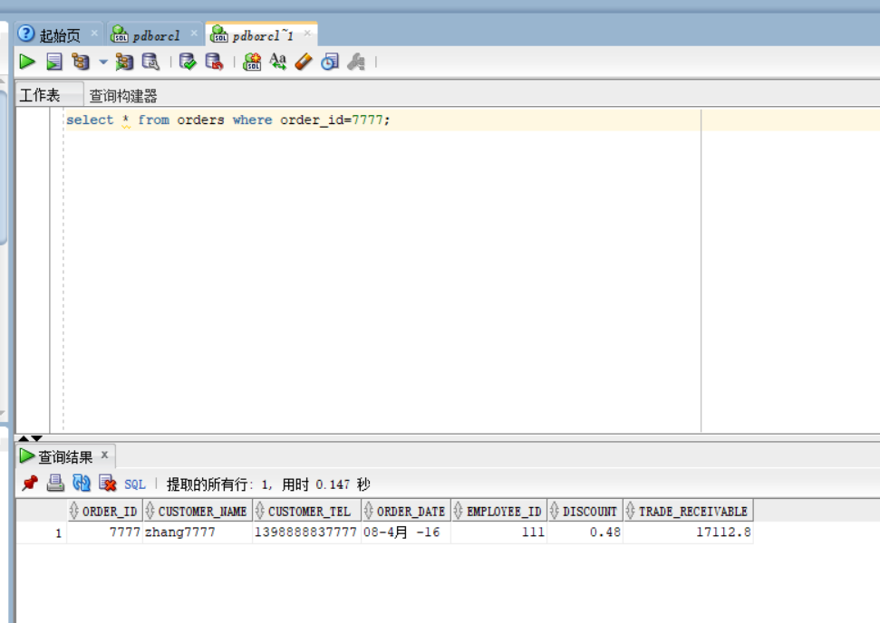

#### 从order_details表中查询该order_id的相关信息
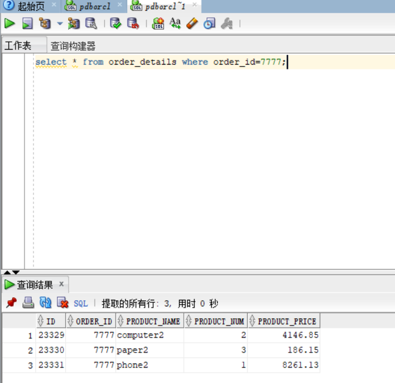

#### 更新指定id在order_details表中的product_num值

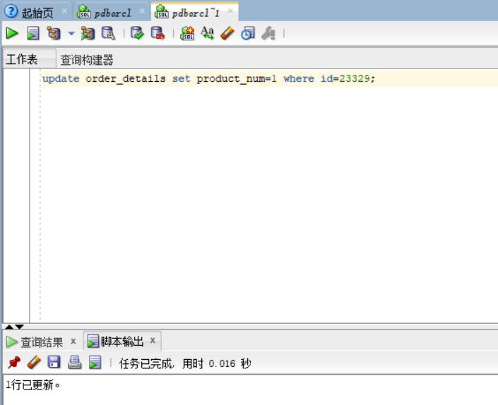
### 删除order_details表中的数据
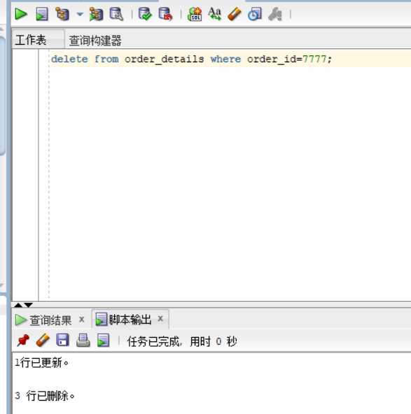
### 向order_details表中插入数据
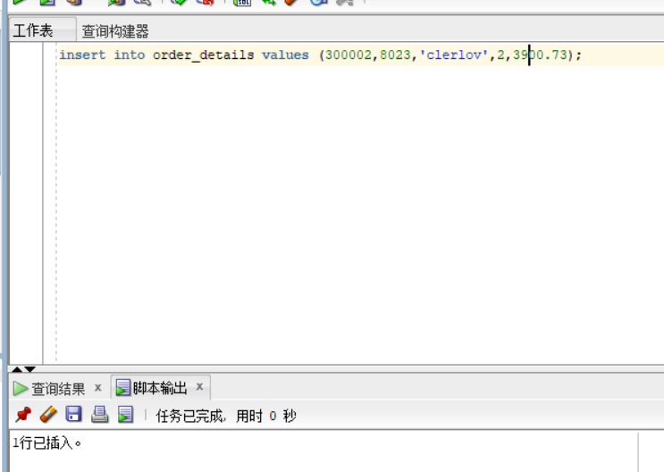
## 查询数据
### 1、查询某个员工的信息
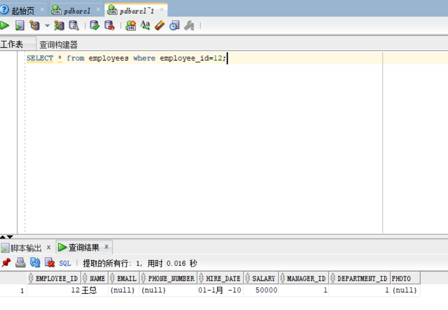
### 2、递归查询某个员工及其所有下属，子下属员工。
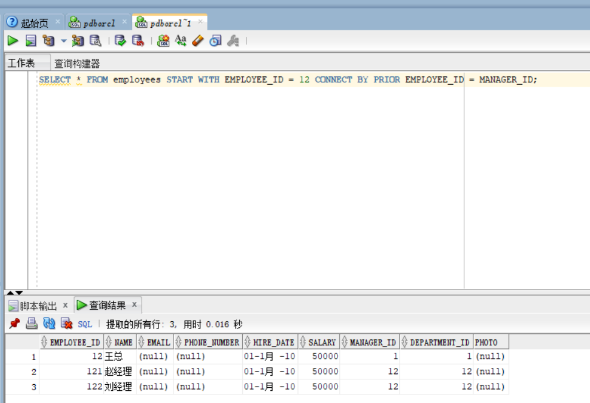### 3、查询订单表，并且包括订单的订单应收货款: Trade_Receivable= sum(订单详单表.ProductNum*订单详单表.ProductPrice)- Discount。
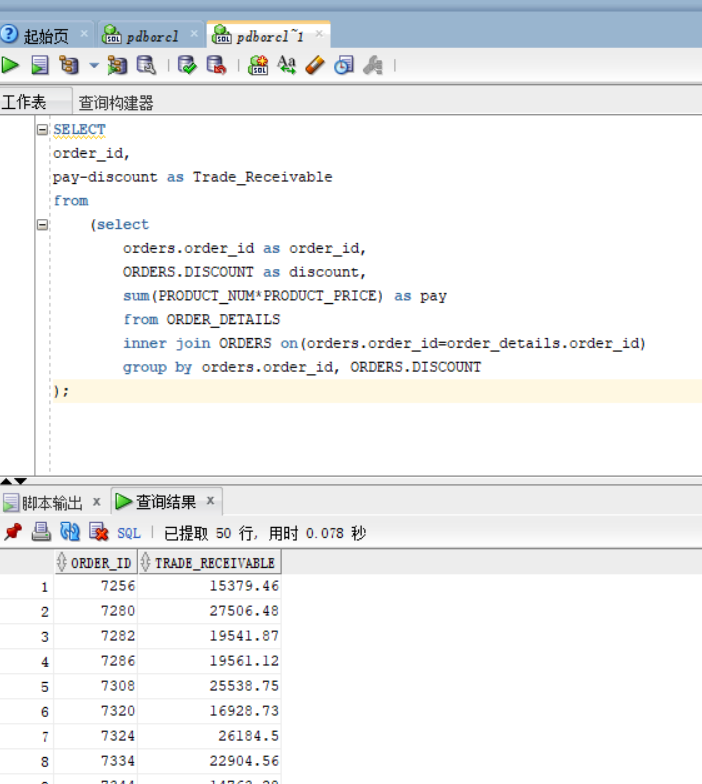
### 4、查询订单详表，要求显示订单的客户名称和客户电话，产品类型用汉字描述。
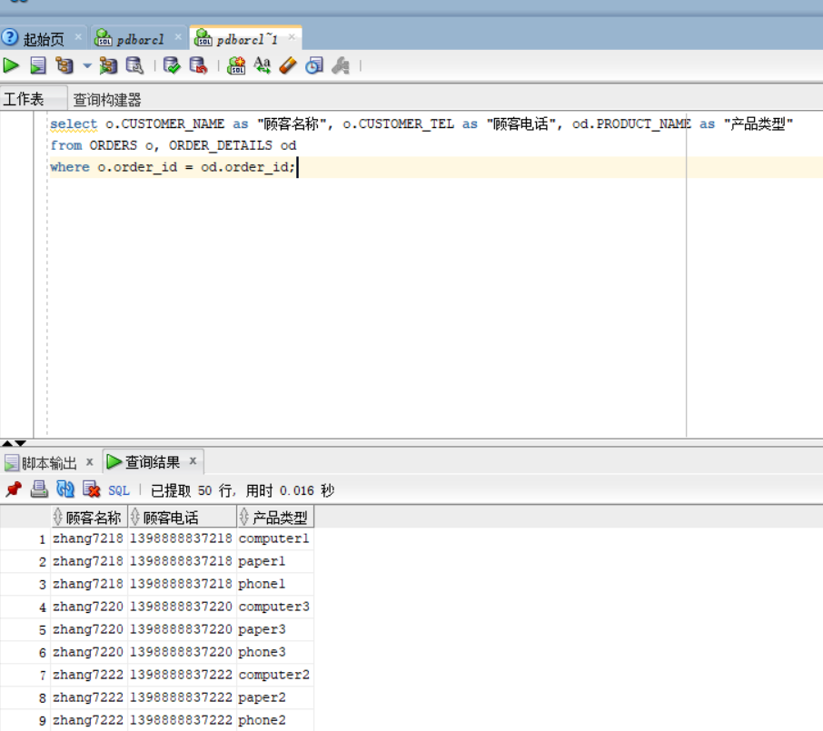
### 5、查询出所有空订单，即没有订单详单的订单。
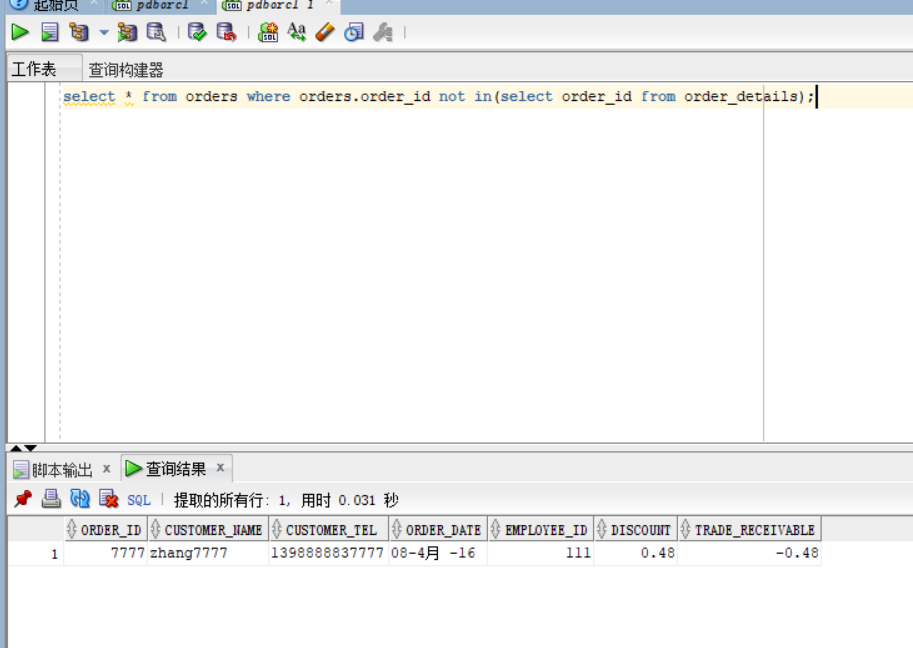
### 6、查询部门表，同时显示部门的负责人姓名。
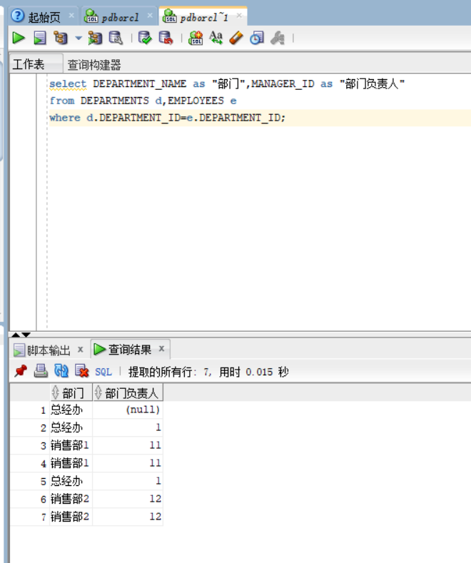
### 7、查询部门表，统计每个部门的销售总金额。
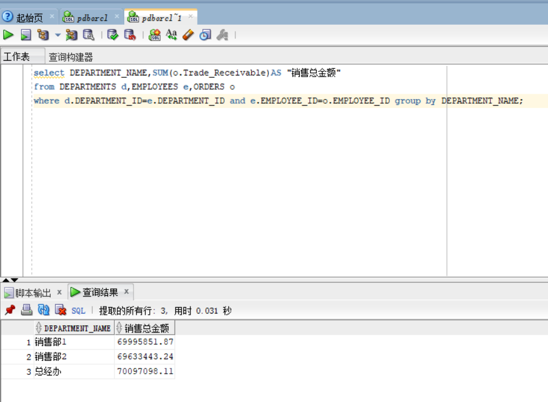
